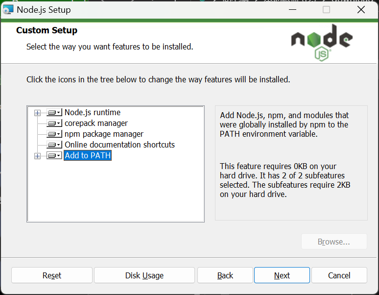
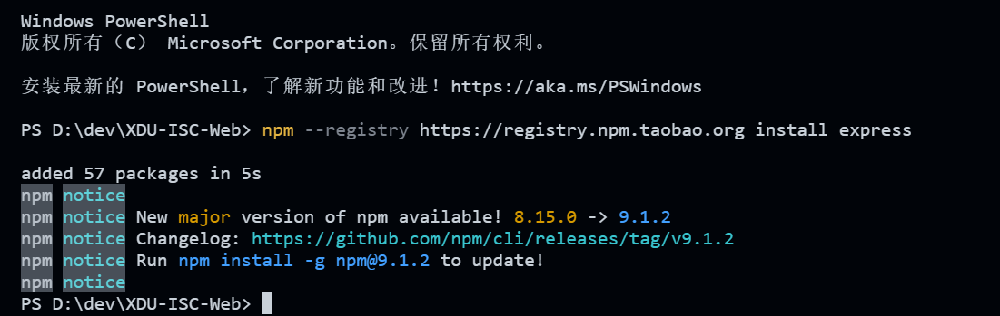

# GitHub博客搭建

为了防止现场网速太拉，建议大家提前完成下面的准备工作

## 准备工作

### 软件安装

首先需要在电脑上准备好用来写博客&生成静态站点的工具。需要在电脑上安装这些软件：

- [node.js（点击下载）](https://nodejs.org/dist/v18.12.1/node-v18.12.1-x64.msi)   它是我们安装hexo的工具
- [git（点击下载）](https://github.com/git-for-windows/git/releases/download/v2.38.1.windows.1/Git-2.38.1-64-bit.exe)       我们用它向GitHub推送我们生成的静态站

上面的链接如果下不了，也可以看群文件or自己搜

注意：**安装node.js的时候，一定保证下图的`Add to PATH`是确认的。**



装好node.js之后，我们需要在电脑上安装**hexo**，这是生成博客站点的核心工具。

用`Win+R`键打开运行，输入`cmd`并回车，在随后弹出来的黑框框中输入下面的指令：

```bash
npm install hexo-cli -g
```

如果网速太慢，可以用下面的指令：

```bash
npm --registry https://registry.npm.taobao.org install hexo-cli -g
```



如果输出内容没有红底的`ERR`，就说明装好了。

### GitHub账号注册

之后，我们还需要在GitHub上注册一个账号。[点击此处前往](https://github.com/)

在主页上找到Sign Up按钮，点击之后按照注册流程即可。


随后我们还需要安装一个MarkDown编辑器，或者装了VS Code也可以用VS Code代替。

推荐几个 MarkDown 编辑器：Typora、Obsidian
